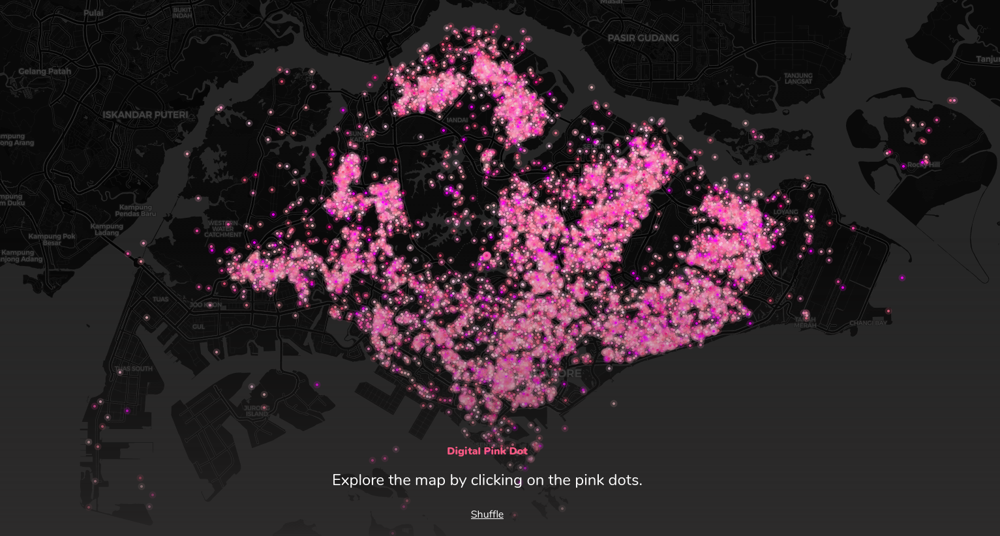

# love-lives-here



This is an exploration of the data from Pink Dot 2020's [digital dot project](https://loveliveshere.pinkdot.sg/).

### Generate data

Generate the data, including names, messages, and coordinates, from `raw_data.txt` (obtained from the Pink Dot website):

```sh
$ pipenv run ipython script.py
```

This will produce the following files:
- `data.csv`: full CSV data
- `data.json`: full GeoJSON data
- `data_messages.csv`: partial CSV data, containing only the messages

The messages are available here at `data_messages.csv`. The full raw and processed data however won't be provided here due to anonymity concerns, though it should be readily obtainable to anyone who's willing to look for it.

### Start server locally

This will make the site available at `localhost:8000`:

```sh
$ python -m SimpleHTTPServer
```

## Explore data

### Exploring names

```sh
$ pipenv run ipython names.py
```

I was interested to see the proportion of people who used their real names, compared to those who used pseudonyms. It turns out that proportion is about 2:1.

### Exploring messages

```sh
$ pipenv run ipython messages.py
```

This explores the message data from the dataset.
- It generates a word cloud (see [wordcloud.png](wordcloud.png))
- It performs sentiment analysis using VADER: the sentiments are on the whole overwhelmingly positive (see [sentiment-histogram.png](sentiment-histogram.png))
- It seems a number of people were fond of saying 'love is love is love is love' over and over... (see [love-is-love.png](love-is-love.png))
